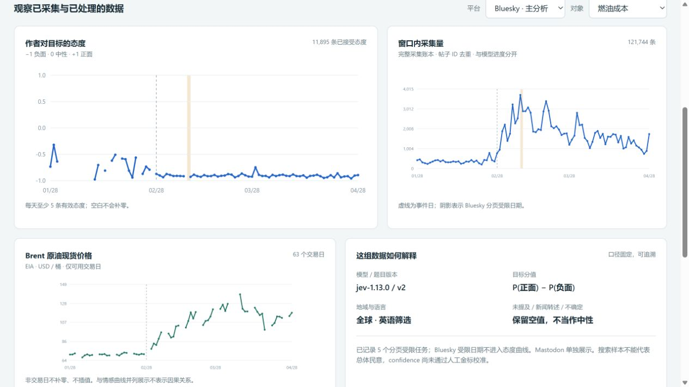

# TransitPulse — Transport Discourse & AI Inference Platform

TransitPulse combines multi-source data ingestion, structured AI inference,
and cloud-hosted APIs for exploratory transport and energy analytics.

**[Explore the interactive demo](https://renfei421.github.io/TransitPulse/)** · [中文项目介绍](docs/PROJECT_CASE_STUDY.zh-CN.md)

**Start here:** [Project case study](docs/PROJECT_CASE_STUDY.zh-CN.md) ·
[Offline interactive results](frontend/transitpulse.html) ·
[Full experiment report](docs/EVENT_EXPERIMENT.zh-CN.md) ·
[Archive and local replay](docs/ARCHIVE_AND_REPLAY.zh-CN.md) ·
[CV and interview material](docs/RESUME.zh-CN.md).

| Completed event-window evidence | Result |
|---|---:|
| Window | 2026-01-28 through 2026-04-28, UTC |
| Deduplicated source posts | 124,491 |
| Structured Jev results | 90,576 |
| Durable request receipts | 90,587 |
| Cumulative model cost accounting | US$11.732 / US$15 cap |
| Oil observations | 63 trading days |
| Original release checks | 201 local tests passed, 1 skipped; 22 cloud API checks |
| Archive recovery | 18 indices / 434,092 documents fingerprint-verified |
| Cloud / local replay | 11 aggregate API comparisons matched |

The model cost includes conservative reservations for uncertain failed requests;
it is not a provider invoice and excludes infrastructure and separate pilots.
All result IDs, text fingerprints, frozen model/rubric contracts and score gates
were checked. Forty-eight purposive **AI** reviews identified semantic issues;
there is no human-gold accuracy claim. The primary same-day Brent-return/fuel-attitude
association was near zero (r=-0.0046, 52 paired dates); this is not causal inference.

## Demonstrate without a paid cloud cluster

Open `frontend/transitpulse.html` directly in a browser. It embeds frozen aggregate
responses and makes no API requests. It contains no original posts or credentials.
Platform/target filters remain interactive. This is distinct from the synthetic demo below.

For full private-data replay, use the dedicated `compose.replay.yaml`, ES 8.19.22,
and the same application API. Follow [the restore runbook](docs/ARCHIVE_AND_REPLAY.zh-CN.md).
Restoration uses preserved results, not new model calls. Cloud retirement is recorded
separately in `docs/evidence/cloud-retirement.json`; archival alone does not stop billing.

## Engineering scope

The executed cloud path used Kubernetes Jobs, Fission REST functions, Elasticsearch,
and the external TypeSafe Jev API. Durable reservations, native-response caching and
at most three paid attempts per document survive Job restarts. An ambiguous timeout
is not claimed to be exactly-once processing. Factual, unmentioned or uncertain
targets abstain instead of becoming neutral sentiment.

Redis Streams/KEDA and RoBERTa remain optional or historical components; the 90,576-row
experiment did not use distributed queue scaling or self-hosted Jev inference.
Production load testing, high availability and autonomous-agent behavior are not claimed.

Earlier pilot/deployment documents describe their historical stages. Current results
are in the experiment report and case study, not the old delivery-report TODO list.

## Run the complete local demo

Requirements: Docker Desktop, Python 3.11 and uv. Run from this repository.

~~~powershell
.\scripts\quickstart.ps1
~~~

Or, on any platform:

~~~bash
uv sync --frozen --extra notebook
docker compose --profile demo up -d --build --wait
uv run --extra notebook python -m scripts.execute_notebook
~~~

- API discovery: http://127.0.0.1:9090/api/v1
- Contract: http://127.0.0.1:9090/api/v1/openapi.json
- Notebook: frontend/hormuz_analysis.ipynb
- Executed notebook: artifacts/hormuz_analysis.executed.ipynb
- Interactive aggregate report: artifacts/analysis.html

The demo uses **720 synthetic social posts and 60 synthetic news articles** in
the separate demo_v2_ index namespace. It uses explicitly identified VADER.
Synthetic records are excluded from API queries unless requested.
The local Flask server is a development harness; deployed HTTP traffic uses
the tested Fission runtime. Local ES/Redis are bound to loopback and anonymous;
cluster deployments require Secrets and verified TLS.

Stop local containers without deleting data: docker compose --profile demo down.
Do not use the volume-deletion option unless deliberately discarding local data.

## What is implemented

- Stable IDs, item-level bulk accounting, request-local time windows and structured logs.
- Resumable NDJSON/gzip import, budgeted Bluesky backfill and bounded Jetstream v1 capture.
- Shared schemas/migration, authenticated ES access and versioned source/model metadata.
- Signed sentiment separate from confidence; topic inheritance; conservative disagreement handling.
- Bounded social processing, batched inference and an optional recoverable Redis Streams queue.
- Resource-oriented API, pagination, sample/coverage diagnostics and compatibility endpoints.
- Calendar-day correlation with sample thresholds and lag-search adjustment.
- Fission specifications, image/dependency locks, Kubernetes Jobs/CronJobs and optional KEDA.
- Unit, real-service integration, HTTP end-to-end and real-model tests.
- GitLab CI definitions, reproducible benchmarks, human-label evaluation tooling.

## Test

~~~powershell
$env:TEST_ES_URL='http://127.0.0.1:19200'
$env:TEST_REDIS_URL='redis://127.0.0.1:16379/0'
$env:RUN_MODEL_TESTS='1'
$env:OMP_NUM_THREADS='2'
uv sync --frozen --extra model --extra notebook
uv run --no-sync pytest -q
uv run python -m scripts.validate_deployment
uv run python -m scripts.audit_repository
uv run ruff check backend database scripts test
~~~

Service tests create unique test_transport_ namespaces and clean only those.
Without TEST_ES_URL / TEST_REDIS_URL, service tests are skipped explicitly.
Model tests require RUN_MODEL_TESTS=1 and the pinned weights.

## Documentation

| Document | Purpose |
|---|---|
| [Architecture](docs/ARCHITECTURE.md) | Data flow, nodes/storage assumptions and scaling limits |
| [Operations](docs/OPERATIONS.md) | Local/cloud deployment, secrets, migration, recovery and rollback |
| [Data expansion](docs/DATA_EXPANSION.zh-CN.md) | Actual source access, acquisition routes and quality gates |
| [Evaluation](docs/EVALUATION.md) | Label protocol, leakage controls and model comparisons |
| [Engineering review](docs/ENGINEERING_REVIEW.md) | Feedback-to-code/test evidence |
| [Delivery report](docs/DELIVERY_REPORT.zh-CN.md) | Measured results, remaining external prerequisites, CV wording |

No fine-tuning or causal effect is claimed. The previous Kubernetes API
was unreachable during the initial hardening work. A new DigitalOcean deployment
now has verified Elasticsearch storage and Fission/API integration. Historical
data coverage and model quality retain the limitations in the linked runbooks;
the Jev event experiment is complete and archived. The public demo serves frozen
aggregate results without a paid cluster or model API. KEDA/load-driven autoscaling
remains unverified.

## Public release

This repository is a clean-history publication of the current reviewed source.
Project notices and dependency acknowledgements are in [NOTICE.md](NOTICE.md).
Private posts, native provider responses, credentials, kubeconfig, recovery ZIPs
and the original Git history are not distributed here.

GitHub Actions runs unit checks and real Elasticsearch/Redis integration tests.
It never calls a paid inference provider or deploys cloud compute. A separate
Pages workflow publishes only the two aggregate HTML demo pages. Original
GitLab CI/deployment definitions remain as documented deployment examples.

The historical experiment evidence describes the measured runs, not a guarantee
that a new harvest returns the same sample. See [PUBLICATION.md](docs/PUBLICATION.md)
for public/private boundaries and reproduction options.
