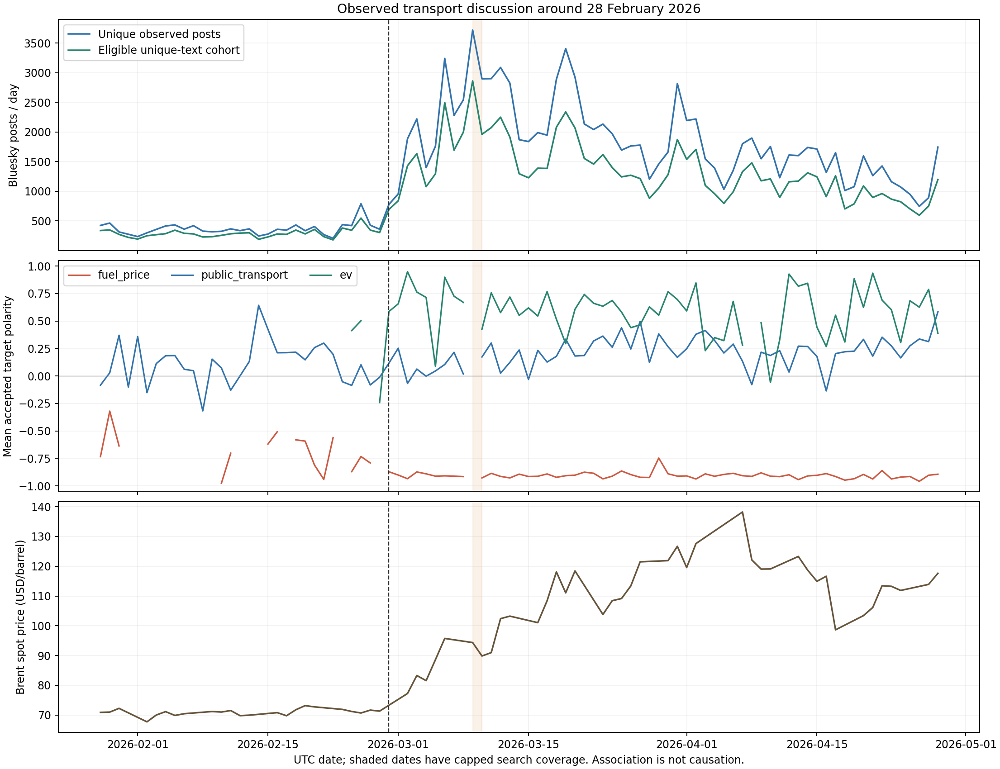

# 美伊冲突事件窗口：全量实验运行记录

> 最新收尾：完整归档和本地恢复已通过，8765 观察页已切换为本地 API；原云端操作记录保留供追溯。云资源删除尚需控制台登录及独立备份，状态以 [归档恢复说明](ARCHIVE_AND_REPLAY.zh-CN.md) 和 `evidence/cloud-retirement.json` 为准。

实验 ID：`iran-20260228-v1`。本次的“全量”指冻结方案中采集到、通过规则筛选的全部唯一文本，并不代表社交平台的完整历史档案。

**全量推理于 2026-10-01 17:03:06 UTC 完成（悉尼 10 月 2 日 03:03）。90,576 条全部成功，最终未恢复文档为 0。** 处理集合、原文指纹、模型/题目契约及评分门控已核验；另完成 48 条 AI 诊断审核，发现的语义问题保留在报告中，不能当成人工金标或准确率评测。默认模型切换的服务验收见下文。

| 最终项目 | 实测结果 |
|---|---:|
| 冻结窗口原始帖子 / 去重合格文本 | 124,491 / 90,576 |
| Jev 成功结果 / 持久化调用回执 | 90,576 / 90,587 |
| 失败请求回执，费用预留继续计入 | 11 |
| 全部请求累计记账 | **US$11.732167902** |
| 成功用量的按 token 估算 | US$11.725119546 |
| 未确定是否收费的失败请求预留 | US$0.007048356 |
| 模型预算上限 / 剩余额度 | US$15 / 约 US$3.27 |
| 成功回执记录的输入 tokens | 279,169,513 |
| 有延迟记录的 HTTP 调用 p50 / p95 | 362 / 446 ms |

这些费用是按 token 单价和保守预留计算的实验账本，**不是供应商账单，不含云基础设施和此前独立 pilot 费用**。最后一轮 `failed_this_run=0`、`transient_request_failures_this_run=3`：三次暂时性请求故障均已恢复，与“文档失败为零”不矛盾。此前八次失败请求也一直保留记账。没有对已完成结果重新付费推理。

完整聚合证据见 [`event-experiment-2026-10-01.json`](evidence/event-experiment-2026-10-01.json)，图形见下文。私有原文与逐条审核保存在忽略提交的数据目录，未公开。

## 时间与研究问题

原报告 `CCC.pdf` 日期为 2026-05-19，示例分析窗口是 2026-02-14 至 2026-05-19。此次按用户要求增加事件前基线，固定为 **2026-01-28 至 2026-04-28，UTC，首尾日期均包含**。事件日为 2026-02-28，来源为 [CENTCOM 的行动事实说明](https://www.centcom.mil/Portals/6/Documents/Publications/260301-Fact%20Sheet.pdf)。

| 阶段 | 日期 | 天数 |
|---|---|---:|
| 事件前 | 01-28 至 02-27 | 31 |
| 事件后第一个月 | 02-28 至 03-27 | 28 |
| 事件后第二个月 | 03-28 至 04-28 | 32 |

研究问题是：所观察到的交通相关讨论量、对燃油成本/公共交通/电动车的态度，如何随时间变化；燃油价格态度与 Brent 价格变动有怎样的描述性关联。地域不限制为澳洲，英语筛选仍保留。不能由这些数据推断总体民意、用户居住地或冲突的因果效应。

## 已完成的采集与入库

| 漏斗 | Bluesky | Mastodon |
|---|---:|---:|
| API 返回条目次数，包括重复和窗外数据 | 124,272 | 29,591 |
| 排除无效条目、窗外日期后的次数 | 123,446 | 4,367 |
| 窗口内按帖子 ID 去重 | 121,744 | 2,747 |
| 命中主题规则 | 95,844 | 1,901 |
| 通过语言筛选及跨文本去重，进入 Jev | **89,280** | **1,296** |

总计 **124,491 条原始帖子、124,491 条筛选决策、90,576 条待推理文本**。原始数据及决策已全部写入 Elasticsearch，逐项 bulk 回执均为零失败。首轮写入都是新建；原始数据采用 create-only，重放不覆盖第一次采集的内容。

Bluesky 凭据已经过实际登录和认证历史搜索验证。每日分别搜索六个词组：`fuel prices`、`petrol prices`、`gas prices`、`electric vehicle`、`public transport`、`public transit`，使用日期过滤和游标分页。Mastodon 从三个实例读取六个相关标签时间线，并按 canonical URI 去重。

所有 564 个采集任务均已到达记录的终止状态，但存在覆盖限制：

- Bluesky：545 个任务耗尽游标，**2026-03-09 的 gas prices 搜索达到 30 页上限**。
- Mastodon：14 个任务翻至窗口之前，`aus.social` 和 `mastodon.au` 的 `electriccars`、`electricvehicles` 共四个任务达到 100 页上限。
- 这些上限、查询和实例都写入 cohort 元数据。主要油价关联及阶段态度均值排除 Bluesky 的受限日期；原始讨论量图仍展示该日并标注。Mastodon 仅作补充分析。

地域文本线索只作为诊断字段；没有地域线索不会被删除。语言路由使用平台语言元数据和 langid，不能当成人工语言标注。规范化文本重复项保留最早帖子进入推理，原始讨论量单独统计。

EIA 已提供窗口内 **63 个交易日**的 Brent 价格。此次修复了旧 Series ID 接口未遵守日期过滤的问题，改用原生 `/v2/petroleum/pri/spt/data/`、日频和 RBRTE facet。收益率按上一条可用价格计算；非交易日不补零、不插值。

## 云端 Jev 处理与费用

模型固定为 `jev-1.13.0`，题目版本 `transport-jev-v2`，阈值为 0.6。每条同时判断相关性、内容类型、整体语气及四个目标的态度。分值是 `P(positive) - P(negative)`，范围为 [-1,1]；confidence 单独保留，尚未经人工金标校准。

未提及目标、仅转述新闻、无法归属于作者、混合态度、上下文不足等情况保留空值。整体语气与针对某个目标的态度分别存储，新闻中的负面事件不自动等于作者对公共交通的负面态度。

首个云端 Job 前 600 条成功、零失败，约 8 条/秒，随后在 691 条成功后因一条原生响应的选项/概率不一致而停止。该速度只描述当时的实际批次，不是生产压测结论。以下故障与恢复段落是历史操作记录；最终状态以文首验收数据为准。

用户已批准**本实验累计 Jev 推理上限 US$15**，不含云服务器费用。研究方案中的初始上限 US$10 保持冻结；单独的 `execution-budget.json` 记录操作额度调整，并绑定输入文件 SHA-256。修复后的后继 Job 使用 US$15 累计限额，从持久化断点继续。

该异常的真实数值为：原生 `choice=factual_only` 概率 0.40，而 `not_mentioned` 概率约 0.41，confidence 为 0.25。[官方 Choice 定义](https://docs.typesafe.ai/primitives/choice)要求选最高概率项；其[官方 SDK](https://github.com/typesafe-ai/typesafe-sdk-python/blob/main/src/typesafe_sdk/_schemas/models.py)把概率和描述为约等于 1。不能证实此差异的供应商内部原因。`jev-rounded-wire-v3` 只对百分位网格的至多 0.01 选项差异做有界兼容：保留选项、概率和差值，受影响的态度必须 abstain/null；更大或高精度差异仍然阻断。不是降低 confidence 阈值，也不是修改模型、题目或打分规则。已有 691 条通过更严格旧校验的结果继续有效，记录各自 validation version。

被拒绝的原生 HTTP 200 响应重新通过验证后，可更新已保存的费用回执并重放，保留原错误原因。31 项模型/事件回归通过，覆盖被拒绝响应的恢复、已付费响应不重复调用，以及显式预算调整不重置累计成本。

每次远程调用前，先在 ES 保存费用预留；收到响应后保存原生响应及实际 token 用量，再写处理结果。ES 写入中断后可以复用原生响应，避免已保存响应的重复调用。网络中断等不确定请求保留保守费用预留，因此成本记录不是供应商账单，也不声称跨所有故障的 exactly-once。

云端只使用现有集群：四个工作线程，最多八次请求/秒；Job 限额 2 CPU、2 GiB 内存，六小时超时，无自动无限重试。缓存使用临时卷；可恢复的响应和费用记录写入现有持久化 ES。没有新增 GPU、节点或负载均衡器。

2026-10-01 13:39:40 UTC，第二个 Job 在累计 **17,640 条成功**时收到一次 HTTP 529 并停止。该请求没有可重放的 HTTP 200 原生响应，保留 US$0.000640542 不确定费用预留；当时累计记账约 US$2.28349。确认旧 Job 已结束后，提交 `transport-jev-event-0f392cd3` 断点恢复，跳过全部 17,640 条已完成结果。13:57 UTC 检查时 ES 已有 **19,395 条**，后继 Job 正在运行、当前批次零失败，累计记账约 US$2.50524。数量与费用分别来自查询和最近一份进度回执，存在秒级更新时间差；这只是检查快照。

2026-10-01 14:22:30 UTC，该后继 Job 又在累计 **31,086 条成功**时停止，记录两次 `ReadTimeout` 和两次 HTTP 520。逐条检查持久化费用回执：四次均无可复用的原生 HTTP 200 响应，合计保留 US$0.002560278；连同之前的 HTTP 529，累计不确定费用预留 US$0.00320082，已经包含在累计记账 **US$4.025661066** 中。14:43 UTC 在所有旧 Job 均终止后提交 `transport-jev-event-dec4e336`，冻结输入、模型、题目、发布包 SHA-256 和累计 US$15 限额均未改变。恢复的聚合证据见 [`event-recovery-2026-10-01T1442.json`](evidence/event-recovery-2026-10-01T1442.json)。14:45 UTC 已确认跳过全部 31,086 条旧结果，ES 处理量增加至 31,426 条；最新回执记录本轮 300 条成功、零失败，累计记账约 US$4.06643，任务继续运行。

2026-10-01 14:59:31 UTC，在累计 **38,114 条成功**后又出现三个请求超时。检查 ES 得到 38,122 份调用回执，其中 38,114 份成功、8 份失败，累计记账 **US$4.937347842**；本次三个失败请求均没有可复用的原生响应。此前的恢复均已成功推进数千条，但原工作器会因一次短时外部错误终止整批。

工作器现增加 `transient-3-total-v1` 有限重试：同一文档在本实验中最多创建三份付费调用预留，失败和结果不确定的预留均计入次数及 US$15 累计限额，跨 Job 重启不重置。只对请求超时、连接中断及明确的暂时性 HTTP 错误退避重试，等待 5 秒、10 秒；达到三次立即停止，不能通过继续提交 Job 绕过。已持久化的原生响应仍可免费重放。鉴权、429、TLS、模型输出校验、ES 写入及预算错误不自动重试。

`failed_this_run` 仍表示最终未恢复的文档数；新增 `transient_request_failures_this_run` 记录当前批次实际遇到的暂时性请求失败，最终费用按所有持久化调用回执核算。35 项模型/事件测试通过，包括两次故障后成功、三次故障后停止、重启不清零、余额不足不发送下一次调用及原生响应不重复付费；故障注入使用模拟供应商接口和本机真实 ES，不消耗 Jev 额度。评分、模型、输入和题目契约未变。15:09 UTC 验证新 Job `transport-jev-event-74914e82` 已跳过全部 38,114 条旧结果，ES 成功量增至 38,535 条；最新回执为本轮 400 条成功、零失败、累计记账约 US$4.99107。完整操作及测试聚合证据见 [`event-retry-policy-2026-10-01T1502.json`](evidence/event-retry-policy-2026-10-01T1502.json)。

## 观察页（当前本地恢复，以下云端命令为历史方式）

在本机访问 **http://127.0.0.1:8765/**。当前页面每 30 秒读取本地恢复 API，已不需要云端连接。启动命令：`uv run --no-sync python -m scripts.serve_event_dashboard --local-api http://127.0.0.1:9092 --port 8765`。独立离线汇总页面为 `frontend/transitpulse.html`。以下保留最初的云端隧道启动方式，仅用于历史说明。

```powershell
# 在项目目录启动；保留此进程运行。
uv run --no-sync python -m scripts.serve_event_dashboard --kubeconfig '..\k8s-1-34-10-do-5-sgp1-1790830229700-kubeconfig.yaml' --directory data/experiments/iran-20260228 --port 8765
```

页面展示成功入库数量、累计费用及预留、当前批次失败数、分平台采集量、四类目标的每日态度、EIA 价格和可翻页的真实帖子。每日态度至少需要 5 条接受结果；受限 Bluesky 日期从态度曲线中排除；没有合格数据的日期留空。帖子按发布时间展示，不是随机质量评测样本。

这是仅绑定本机回环地址的观察入口，不是公共网站。电脑休眠或本地服务退出会中断网页连接，但不会中止云端任务。重新启动上述命令即可恢复观察。当前全量已完成，页面显示完整冻结样本；统计解释和质量限制以本报告为准。旧的 9090 演示入口不代表本次真实实验。

2026-10-01 16:58 UTC 左右，本机观察服务仍在运行，但其 `kubectl port-forward` 子进程退出，导致代理返回 502；云端推理继续正常推进。已恢复入口，并加入只读隧道重连：连接失败后在后续刷新中重建本地隧道，连接尝试至少间隔 30 秒，并发刷新只创建一条隧道。旧连接的延迟失败不会拆除新连接，云端 HTTP 业务错误不会触发重连。5 项观察页测试通过，另在隔离的本地测试隧道上验证了真实连接中止后恢复 HTTP 200；未重启云端 Job 或增加模型调用。聚合证据见 [`event-dashboard-reconnect-2026-10-01.json`](evidence/event-dashboard-reconnect-2026-10-01.json)。

## 运行和验收

在项目目录运行。API key 从忽略提交的私有文件或 Kubernetes Secret 读取，不放入命令行。

```powershell
uv sync --frozen --extra experiment
$kube = '..\k8s-1-34-10-do-5-sgp1-1790830229700-kubeconfig.yaml'
$experiment = 'data/experiments/iran-20260228'

# 只读：查看云端数量、费用和 Job 状态。
uv run --no-sync python -m scripts.cloud_event_experiment status --kubeconfig $kube --directory $experiment

# 仅在旧 Job 已结束且需要继续时提交；工具会拒绝并发重复 Job。
# 此操作会消费剩余额度，沿用同一 cohort 和累计费用记录。
uv run --no-sync python -m scripts.cloud_event_experiment submit --kubeconfig $kube --directory $experiment

# 只有云端 run 标记 complete 才会生成完整分析。
uv run --no-sync python -m scripts.analyze_event_experiment --kubeconfig $kube --directory $experiment
```

已有 Fission API 已更新：

- `/api/v1/experiments/status?experiment_id=iran-20260228-v1`
- `/api/v1/social/posts?from=2026-01-28&to=2026-04-28&timezone=UTC&model=jev-1.13.0&experiment_id=iran-20260228-v1`
- `/api/v1/social/target-sentiment?from=2026-01-28&to=2026-04-28&timezone=UTC&model=jev-1.13.0&experiment_id=iran-20260228-v1&topic=fuel_price`

上述三个地址均经真实云端请求验证 HTTP 200，原有 15 项 API 检查也通过。通过认证的 kubectl 隧道访问；没有创建公开互联网入口。实验状态现为 complete，原来的 RoBERTa 数据仍在独立索引，新实验全程只使用 Jev。

已确认处理 ID 集合与冻结输入完全相同，90,576 条模型、contract 和文本指纹一致，三份冻结数据文件的 SHA-256 未变。离线另逐条从保存的概率重算 `P(positive)-P(negative)`，重建 confidence、state、相关性和截断门控，并比较公开目标字段与原生证据派生字段，全部通过。89,885 条使用 v3 校验、最初 691 条使用更严格的 v2。134 个整体/目标状态测量存在有界选项差异并已 abstain，其中目标状态 121 个；另有 74 个 relevance/content/tone-state 决策存在该差异。这些是测量次数，不是互斥的帖子数量。

分析报告按实际日历天数比较讨论量，用足够样本日的等权均值比较态度。主要关联为同日 Brent 上一可用观测收益率与 Bluesky 燃油成本态度；其他日历滞后仅作探索，移动块 bootstrap 区间不等于因果识别。没有有效态度的日期保持缺失。

## 观察到的结果

| Bluesky 指标 | 事件前 31 天 | 事件后首月 28 天 | 后续 32 天 |
|---|---:|---:|---:|
| 每个日历日采集到的去重帖子 | 364.1 | 2,243.8 | 1,488.5 |
| 燃油成本态度均值（有效日数） | -0.699（16） | -0.904（27） | -0.906（32） |
| 公交态度均值（有效日数） | +0.110（31） | +0.183（27） | +0.236（32） |
| EV 态度均值（有效日数） | +0.257（8） | +0.616（27） | +0.561（31） |

首月观测帖子日均约为事件前的 **6.16 倍**，后续阶段约 **4.09 倍**。这是既定词组检索到的样本变化，不能等同于整个平台讨论量或冲突造成的增长。原始讨论量保留受限日；态度均值排除 3 月 9 日，每天至少 5 条接受结果，日均值等权。EV 基线仅 8 个有效日，跨阶段差异尤其不稳定。

全部平台合计接受 **11,918 个燃油成本态度、4,862 个公交态度、1,209 个 EV 态度、802 个燃油车态度**；同一帖子可能贡献多个目标，不能将这些数相加称为独立帖子数。模型将 78,621 条归为 related，但通过相关性判断也不必然存在可评分的作者态度。Mastodon 每个目标、每个阶段都没有达到日阈值的有效日，因此不报告其阶段态度均值；空值不补成中性。

预先指定的同日关系有 **52 对有效观测**，Pearson **r=-0.0046**，五观测块 bootstrap 95% 区间 **[-0.133, 0.132]**。本样本中没有观察到明显同日线性关联。全部探索性日历滞后的区间也跨零；不能挑选某个滞后作为确定性结论。这个检验针对每日价格变动与当日接受态度均值，并非价格水平、消费行为或因果效应检验。事件前后均值不同与同日涨跌相关接近零并不矛盾。



图形已检查：三幅图使用同一日期轴；事件日为虚线；分页受限日期着色；不足阈值/受限日的态度断开，不插值。Brent 线只连接已有交易日价格，分析时没有生成非交易日价格或收益率。

## AI 样本审核与可使用范围

先按平台 × 阶段 × 模型内容类型选每个已出现层中 doc_id 排序最小的帖子，共 **34 条**，审核四个目标及元数据；再按平台 × 目标 × 接受标签补选、按帖子去重，新增 **14 条**，重点审核接受的目标。合计 **48 条**。这是确定性的诊断选样，使用了模型分层，**不是随机样本、不是人工金标，也不是盲审**，不能据此报告 precision/recall/F1 或 48 条中的“准确率”。

审核记录有 28 条判断基本合理、9 条语义模糊、3 条疑似遗漏、5 条疑似错误接受、2 条元数据疑点和 1 条时间指代疑点。分类反映 AI 审核意见，不是总体错误率：

- 相关性门控会过滤掉短句中的明确燃油抱怨，或正面的轻轨出行体验。严格门控有漏检代价。
- 部分经济机制、成本比较与公交可行性解释被接受为 neutral；按严格题目，应保留 factual_only/null。
- 个别一般汽车偏好或反汽车依赖的评论，被归为燃油车态度；原文没有给出动力类型。
- 喜欢低油价的泛化偏好，不等于赞同当日实际油价；不能把目标态度直接解释为对同步行情的反应。

**工程验收通过，语义质量仍属探索性。** 保留冻结结果和原题目，不据事后审核修改分数或重跑全量。下一轮优先人工双标上述边界样本、评估门控的遗漏与错误接受，再比较更短题目/目标路由的成本和质量；本次不新增模型消费。原生概率或高 confidence 都不是已在本任务校准的正确概率。

## API 切换和最终验证

已通过 `fission spec validate` / `fission spec apply --wait` 部署，云端配置由 `scripts/cloud_fission.py` 固定生成 `SOCIAL_ACTIVE_MODEL=jev-1.13.0`。配置摘要随运行环境模板更新，避免旧容器继续使用旧值；下一次相同部署仍保留默认模型。社交 API 在缺省 model 时按精确模型版本过滤，响应 meta 给出实际模型；新闻、油价和独立 LLM annotations 不受该默认值影响。

- `/api/v1/meta` 实测返回默认模型 Jev。
- 窗口与 experiment_id 限定的默认 `/quality` 返回完整 **90,576 条 Jev 结果**，无模型混合。
- 默认帖子和目标态度查询返回 200；燃油目标查询覆盖 91 个日期。API 返回的低样本日仍须由分析层按阈值处理。
- 显式 `model=cardiffnlp/twitter-roberta-base-sentiment-latest` 可以读取原基线；原基线恢复数据不属于本次冻结历史窗口，因此不能当作配对质量对照。旧模型不支持目标态度，调用对应资源返回 400。
- 实验查询返回 complete。原有 **15 项云端 API 检查 + 7 项切换检查**均通过。证据见 [`event-api-cutover-2026-10-01.json`](evidence/event-api-cutover-2026-10-01.json)。

本机真实 Elasticsearch/Redis 环境下 **201 项测试通过、1 项跳过**；跳过的是需显式下载/加载原 RoBERTa 权重的测试。另通过 32 个声明式部署资源验证、ruff 和凭据/TLS 回归检查；已核对可提交文件不含实际私有凭据。图形及页面均已检查。

模型任务已经终止成功；不再提交推理 Job。此次验收只证明上述规模的数据处理、恢复和查询结果，不证明生产吞吐、负载下自动扩缩容、模型准确率或因果效应。云集群与持久化卷按用户要求保留，**仍会产生基础设施费用**；本次没有删除资源。

## 文件和限制

- 冻结方案：[`experiments/iran-20260228.json`](../experiments/iran-20260228.json)。
- 聚合启动证据：[`docs/evidence/event-start-2026-10-01.json`](evidence/event-start-2026-10-01.json)。
- 本机 `data/experiments/iran-20260228/` 保存 SQLite 分页账本、原始 NDJSON、决策、输入、价格、Job 及额度记录；全部忽略提交。`artifacts/` 保存测试、发布和运行日志。
- YouTube API 可以读取公开数据，但本次没有把 YouTube 内容送入情感推理；衍生指标用例申请尚未完成。没有用实时 Jetstream 伪造历史回溯，也没有混入 7—10 月恢复阶段的数据。
- 本次没有重新采集历史 GDELT 新闻；结论仅覆盖上述社交平台与 EIA 数据。
- 可在简历描述：基于 Kubernetes/Fission/Elasticsearch 构建多源交通舆情管道，采集并去重 124,491 条窗口帖子；在 US$15 预算内完成 90,576 条结构化推理，建立持久化费用回执、失败恢复、按目标评分门控和逐条溯源验收。US$11.73 是模型记账，不能写成全部云平台成本。
- 可说明 48 条 AI 诊断样本发现了事实/态度及车型归属边界问题，并如实呈现无明显同日油价关联的结果。不要声称因果识别、已测得高准确率、生产级扩缩容能力或课程团队全部工作由单人完成。

## 归档与本地重现验收（2026-10-02 悉尼）

18 个应用索引共 434,092 条文档已完整导出并恢复到独立的本地 ES 8.19.22。每个索引的完整 ID/source/routing 指纹均匹配；该总数包含原文、决策、回执和早期试验，不能写作独立帖子数。11 组云端/本地聚合响应一致，另有 11 项本地路由检查，包括 16 条跨页真实帖子、旧模型显式查询和错误状态码。

从归档独立重算了全部 90,576 条评分门控、输入指纹、模型/题目契约、日/阶段统计、关联与费用；与原分析一致，没有新的模型或网络调用。本轮回归测试 208 项通过、1 项旧模型权重测试跳过。

已准备 233 个待人工标注的 post-target 任务，覆盖 225 条不同帖子，按平台/阶段/对象/模型接受状态分层。所有人类标签为空，这些是待办评测任务，不是新增人工金标。

证据：[完整恢复](evidence/archive-restore-verification.json)、[API 一致性](evidence/local-replay-api-parity.json)、[本地路由](evidence/local-replay-routes.json)、[离线重算](evidence/offline-analysis-verification.json)。云资源是否已删除必须单独查看 [收尾状态](evidence/cloud-retirement.json)，不能从本地验收推断计费已停止。
