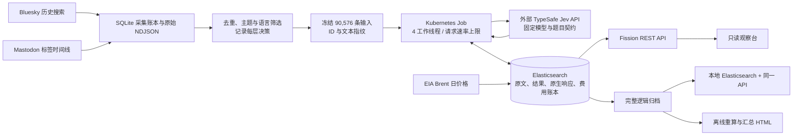

# TransitPulse：多源交通舆情与成本受控 AI 推理平台

TransitPulse 整合多源社交数据、结构化情感推理与云端分析 API，用于研究事件窗口内的交通舆情与能源价格关联。当前成果定位为可复现的 AI 数据平台和探索性分析项目，不声称生产规模部署、自主 Agent、自研基础模型或因果识别。

## 问题与使用场景

交通研究者希望了解：能源价格变化的事件窗口内，公共交通、燃油成本与电动车相关讨论如何变化？一条帖子可能同时赞扬公共交通、抱怨燃油价格，简单的整帖正负面分类无法回答这个问题。多平台的查询覆盖也不同，抓到更多帖子并不自动代表更可靠的民意结论。

TransitPulse 将原始采集、筛选决策、模型证据与聚合结果分开保存。分析者可以追溯一项结果来自哪里、为什么接受或拒绝评分、推理花费多少，以及结论在哪些数据范围内成立。

## 实际规模与结果

| 指标 | 已完成的冻结实验 |
|---|---:|
| 事件窗口 | 2026-01-28—2026-04-28，91 个 UTC 日期 |
| 去重后的原始帖子 | 124,491 |
| 合格唯一文本 / Jev 结果 | 90,576 / 90,576 |
| Brent 价格 | 63 个交易日 |
| 持久化调用回执 | 90,587，其中 11 份失败/不确定费用回执 |
| 累计模型记账 | US$11.732167902，预算 US$15 |
| 最终未恢复文档 | 0 |
| 原云端验收 | 201 项本地测试通过、1 项旧模型测试跳过；22 项云端 API 检查通过 |

费用按用量估算和失败请求预留计算，不是供应商账单，不含基础设施和先前独立 pilot。归档中还保留此前试验，因此数据库总数与正式事件窗口的数量不同。

## 已执行的架构

云端是两个 4 vCPU/8 GiB 工作节点；Elasticsearch 单数据节点及 20 GiB 持久卷，Fission 包存储为 1 GiB。此配置不是高可用数据库。推理发生在供应商 API，本集群承担采集、编排、存储与查询，没有自托管 Jev 或 GPU 推理。

仓库包含 Redis Streams、KEDA 等可选实现，但本次事件实验没有使用它们，不能将其描述为已验证的生产弹性伸缩能力。配置的请求上限和一次批处理速度也不能当作负载测试结果。

## 四个值得深入讨论的工程决策

1. **先存费用预留和请求证据，再提交处理结果。** 外部调用与数据库写入不是一个事务。保存了原生响应后，可以在写入失败时恢复，避免重复调用；收到超时但不确定供应商是否处理的请求继续计费预留。没有宣称跨所有故障的 exactly-once。
2. **限制重试而不是持续重跑。** 每条文档最多三份付费调用预留，跨 Job 重启累计；只对指定暂时性故障重试。预算、鉴权、评分契约错误不自动重试。
3. **评分与门控分开。** 目标分值为 `P(positive)-P(negative)`；未提及、事实转述、无法归于作者、低置信等状态保留空值。confidence 不是已经校准的正确概率。
4. **使用完整文档归档验证可迁移性。** 保存 `_id`、完整 `_source`、索引定义与调用证据；恢复后比较全部文档的顺序无关指纹，再比较 API 聚合。备份不是“导出一份图表”或“保留一个 Git 仓库”。

## 分析发现及决策价值

主要检验在 52 个有效日期对中得到 Pearson r=-0.0046，五观测块 bootstrap 95% 区间 [-0.133, 0.132]。该样本没有显示明显的同期线性关联；不支持直接根据当日油价涨跌预测交通态度。

Bluesky 观测帖子日均数在事件后首月约为基线的 6.16 倍，但这是固定查询返回的样本变化，不是平台总体变化或因果效果。一个 Bluesky 查询日触及页数上限，被排除出主要态度关联；Mastodon 的日有效态度不足以支撑同样的阶段估计。呈现缺失与覆盖限制，比画一条平滑趋势线更重要。

48 条确定性分层样本由 AI 做诊断审核，发现事实/中性混淆、相关性漏检和车型归属问题。这不是人工金标，不能报告准确率。后续人工评测任务包与规范已经单独设计，是否完成以 [评测说明](HUMAN_EVALUATION.md) 为准。

## 如何展示与核验

- [独立离线页面](../frontend/transitpulse.html)：内嵌汇总 JSON，不请求云端，不包含原始帖子。
- [实验方法和结果](EVENT_EXPERIMENT.zh-CN.md)：完整口径、错误恢复历史与限制。
- [归档和恢复说明](ARCHIVE_AND_REPLAY.zh-CN.md)：私有数据恢复、文件核验与资源清理状态。
- [简历与面试表述](RESUME.zh-CN.md)：AI 工程及数据分析两种版本。
- [四分钟演示脚本](DEMO_SCRIPT.zh-CN.md)：用问题、故障恢复和结果解释项目。

项目不依赖长期保留付费集群来证明存在。源码与声明式部署描述保留；完整帖子和原生响应只在私有归档内保留，公开展示使用汇总数据。
